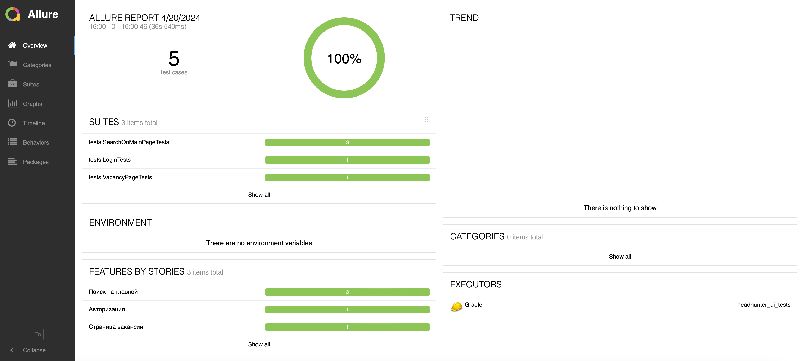
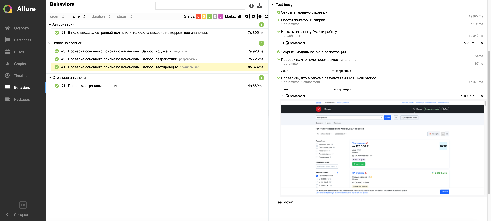

# Пример UI тестов для сайта hh.ru с использованием PageObject

---

Стек:  
Java, Gradle, JUnit5, Selenide, Allure Reports

---

Реализовано несколько тестов:
- на проверку поиска (с использованием параметризации);
- на проверку содержимого страницы с вакансией;
- один кейс на авторизацию.

---

Пример отчета:  

